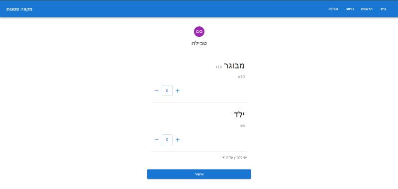

# MikveBookingSystem

**MikveBookingSystem** is a web application developed to record and manage the usage of Mikve (ritual bath) services. Users log their visits to the Mikve through the system, ensuring accurate tracking and streamlined service reporting.

## Preview

Below is a screenshot of the Mikve usage logging interface:



## Features

- **User Authentication**: Secure user registration and login.
- **Usage Logging**: Simple interface for recording Mikve usage after each visit.
- **Admin Management**: Tools for administrators to monitor service usage and manage user accounts.
- **Service Reports**: Generate usage reports for operational insights.

## Technologies Used

- **Frontend**: React.js
- **Backend**: Node.js, Express
- **Database**: MongoDB
- **Authentication**: JWT (JSON Web Tokens)

## Getting Started

To run this project locally, follow these steps:

1. Clone the repository:

   ```bash
   git clone https://github.com/Noammandelbaum/MikveBookingSystem.git
   ```

2. Install dependencies:

   ```bash
   cd MikveBookingSystem
   npm install
   ```

3. Start the server:

   ```bash
   npm start
   ```

4. Open the app in your browser at [http://localhost:3000](http://localhost:3000).

## Contributing

We welcome contributions! Please fork the repository, create a new branch for your feature or bug fix, and submit a pull request. Ensure your code follows best practices and is well-documented.

